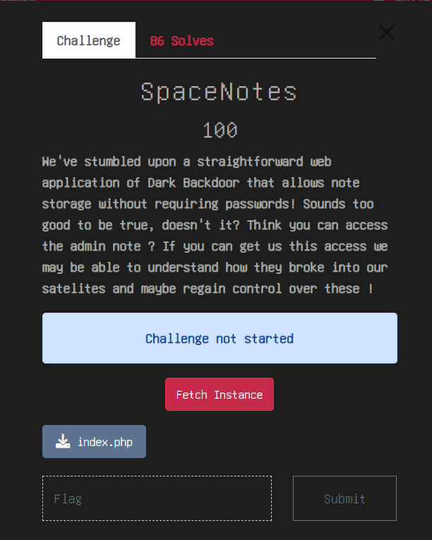
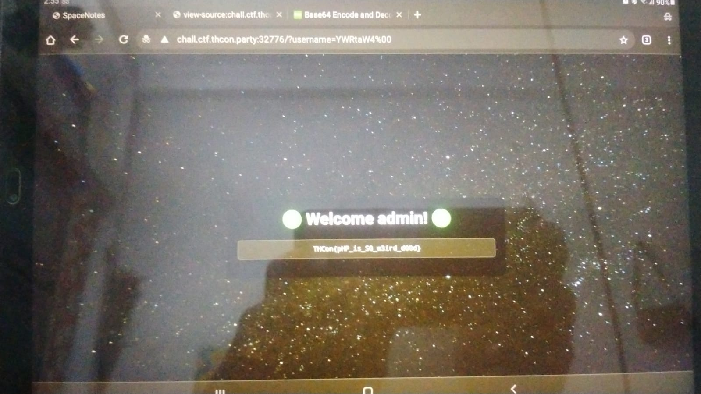

# SpaceNotes - THCON 2024

## Challenge


## Understanding the challenge

### Looking at the webpage

```
chall.ctf.thcon.party:port/?username=base64encoded-string
```
- We have to retrive admin user notes.
- Directly accessing through admin base64 encoded string gives an error maybe there are some checks running.
- Now we will look at the index.php file attached to the ctf.

### Looking at the useful code

```
if (isset($_GET["username"])) {
    $encodedUsername = str_replace("=", "", $_GET["username"]);

    // Username is not admin
    if ($encodedUsername === "YWRtaW4") {
        $decodedUsername = "";
    } else {
        $decodedUsername = base64_decode($encodedUsername);

        // Check if the username contains only alphanumeric characters and underscores
        if (!preg_match('/^[a-zA-Z0-9_]+$/', $decodedUsername)) {
            $decodedUsername = "";
        }
    }
}
```
```
<?php elseif ($decodedUsername === "admin"): ?>
    <h1>🟢 Welcome admin! 🟢</h1>
    <p><?php echo $flagMessage; ?></p>
```

- In the first code block there are some checks
  1. It first removes '=' from the base64 encoded strings.
  2. Then it checks if the encoded string is strictly equal to 'YWRtaW4' (admin).
  3. If it is equal it changes the decoded username to blank space which will give error.
  4. If it is not equal it decodes the base64 and matches that username only contains a-z,A-Z,0-9 and _ .
  5. If it contains other than those given things decoded username becomes blank.

- In the second code block
  1. If the decoded username is strictly equal to admin then it runs 'flagmessage' function.
  2. 'flagmessage' function only pulls the contents of flag.txt file.

## Solution
- To bypass the checks add the null byte '%00' at the end of base64 username.
  1. By adding the null byte the encodedusername will not be strictly equal to 'YWRtaW4' which bypasses first condition.
  2. When it is decoded from base64 it removes null byte character and the username becomes admin.
  3. This satisfy the condition in 2nd code block and i got the flag.



#### Note:- The SpaceNotes and base64custom challange dont have good quality images because i was away from my laptop and i was only using my tab so most of the procedures in both the challanges are bit lengthy because i was doing all the things manually. (on paper) 
