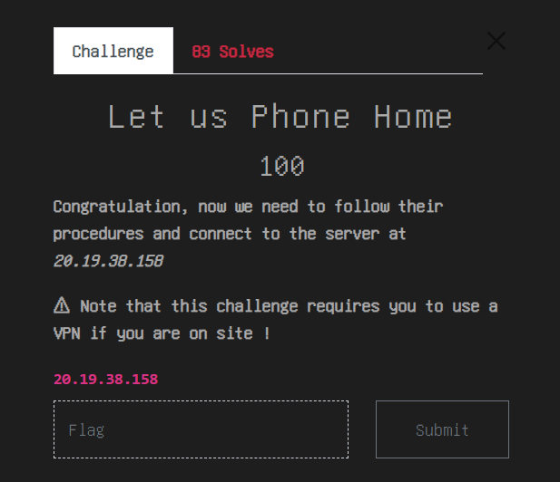

# Let-us-Phone-Home THCON 2024

## Challenge


## Solution
- In the challenge find me if you can the procedure told was connect to port 4242 with pssword 'THCON{E.T.-PH0N3-H0M3}'

```
nc 20.19.38.158 4242
```

- After running the above command type the password i.e.
```
THCON{E.T.-PH0N3-H0M3}
```
- After that it gave the flag and port to connect for next challenge but unfortunately i was not able to solve the next challenge.

```
flag : THCON{I_H4V3_4_84D_F33L1NG_4B0UT_TH15}
```
