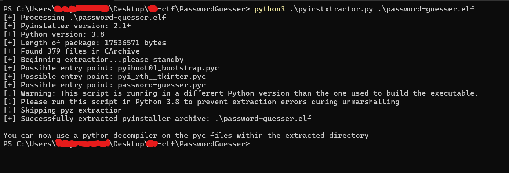
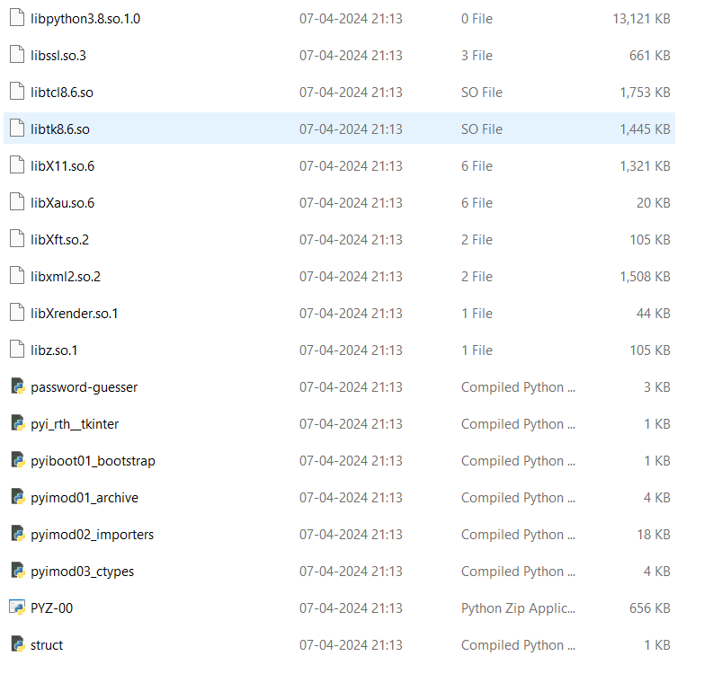
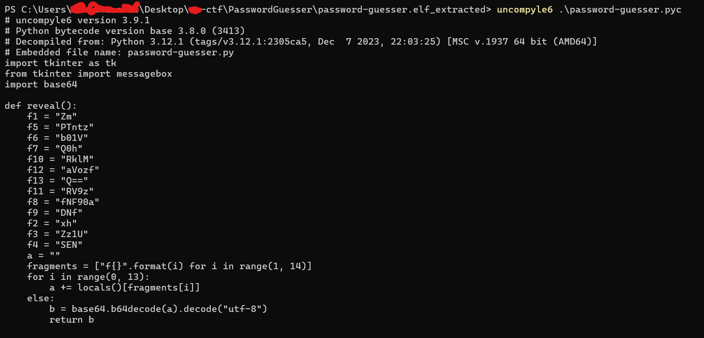

# PasswordGuesser THCON 2024

## Challenge


## Understanding the challenge
- The description suggests that there is a secret hidden in the source code of the password-guesser and secret is given when we give password.
- There is also a file password-guesser.elf
- Maybe we have to decompile it to get the secret.
- Assuming it is written in python lets move forward.

## Solution
- To decompile ELF file written in python there is a tool pyinstxtractor so lets decompile it using this tool.


- Decompiled folder contains many files but we are interested in password-guesser.pyc because it is the main file and it contains the secret.
- It is a compiled python file so we have to decompile it also.
- It can be decompiled using tool 'uncompyle6'.

- In the reveal function f1-f13 arranged in ascending order is the base64 encoded flag.
```
f1 = "Zm"
f2 = "xh"
f3 = "Zz1U"
f4 = "SEN"
f5 = "PTntz"
f6 = "b01V"
f7 = "Q0h"
f8 = "fNF90a"
f9 = "DNf"
f10 = "RklM"
f11 = "RV9z"
f12 = "aVozf"
f13 = "Q=="
```

- base64 encoded flag
```
ZmxhZz1USENPTntzb01VQ0hfNF90aDNfRklMRV9zaVozfQ==
```

- base64 decoded
```
flag=THCON{soMUCH_4_th3_FILE_siZ3}
```

### flag : THCON{soMUCH_4_th3_FILE_siZ3}