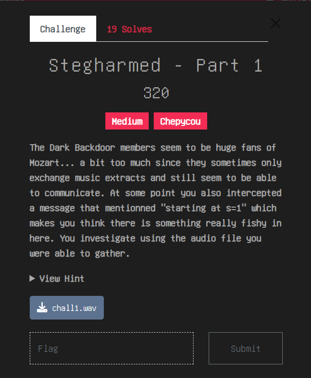
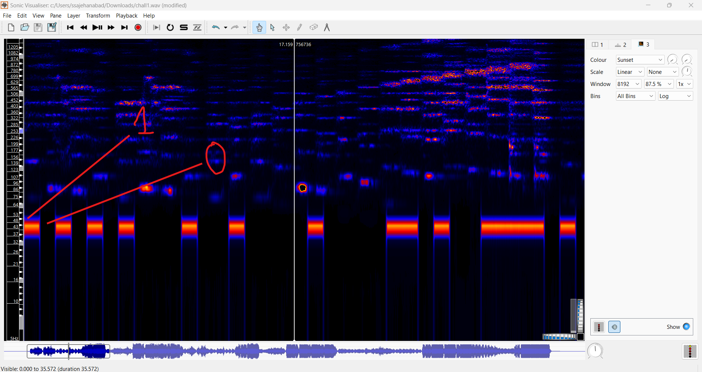

# Stegharmed - Part 1 THCON 2024

## Challenge


## Understanding the challenge
- In this challenge we are given an audio file.
- We are also given some some texts about audio file but i didnt understood even a single word of that.
- At first i was searching for morse code then i took hint for 20 points and then i realised there is binary.

## Solution
1. Open the audio file in sonic visualiser.
2. Under the pane option in menu select melodic range spectogram.
3. There you will see some blocks coloured and some not coloured.
4. The coloured block represents 1 and non coloured block represents 0.



5. After extracting the binary it looks like this.
```
10101010001001000010000110100111101001110011110110100111101001110001100110101111100111000001100010101010001111101
```
  - It contains 113 bits and we know that 1st word will be T because it starts with 'THCON' and binary of T is 01010100 so maybe 1st digit 1 is extra byte after removing it it looks like this:

```
0101010001001000010000110100111101001110011110110100111101001110001100110101111100111000001100010101010001111101
```
6. After converting the binary to ascii the flag is obtained.

```
THCON{ON3_81T}
```